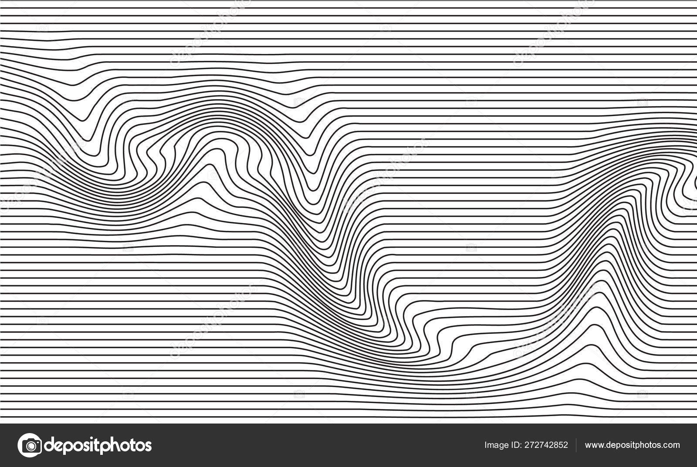
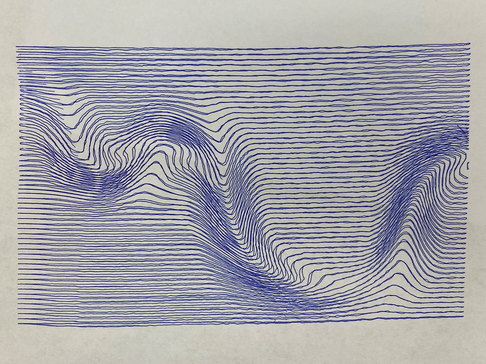

# HarpBot
Code and documentation related to the HarpBot robot for the STARS Harpeth Hall Winterim robotics course.

## Repository Contents
* ./HarpBot
  - This is the Python library HarpBot where all of the plotting and kinematics exercises are implemented. 
* ./CAD
  - The SolidWorks files for actually building the drawing robot live here.
* ./Grbl
  - The Arduino code which controls the robot lives here. 

## HarpBot Python Library
TODO

## Using the Drawing Robot

Here, we'll outline an example case where we use the drawing robot to draw a vector graphics file from an image online. Specifically, we'll draw this image:

### Requirements
1. Working drawing robot running the GRBL Arduino code in ./Grbl.
2. Inkscape, an open source vector graphics program.
3. Universal G-code Platform, an open source program for sending G-code commands to CNC machines over a serial connection. 

### Steps
1. First, import the example image ./Images/ExampleImage.jpg into Inkscape.
2. Next, we want to convert the raster images into a vector image by tracing it. To do this, select the image and then do path->trace bitmap. Adjust brightness cutoff until it looks good.
3. Delete the bottom banner on the image and then do path->object to path to make the tracing a vectorized path.
4. Adjust the fill to no fill and stroke to just lines.
5. Scale the image and position it to be approximately in the middle of the vertical page.
6. Next select the created paths and then do extensions->modify path->add nodes. Select by max segment length and choose 1.0 mm. The reason for doing this is hard to explain, but we need more interpolation points so that lines are straight instead of curved.
7. Now we have to generate the G-code from the vector paths. Do extensions->G-code tools->Path to G-Code. Use all of the default options, except under the options tab set "Scale along Z axis" to 2.0 and "Offset along Z axis" to -5.0. These ensure that the pen lift servo mechanism actuates. Optionally, you can change the output filename and directory under the preferences tab.
8. The extension should have generated a large grey box with text options inside it. Repeat the previous G-code generation step after setting "Feed" and "Penetration feed" both to 6000.
9. Launch Universal G-Code Platform and open the generated G-Code file. 
10. Connect to the robot on whatever port you have it plugged into.
11. Jog to Z axis up and down. This pulls the pen lift up fully.
12. Click the play button. This should start the robot moving along the G-code trajectory.

These steps resulted in the following drawing:

